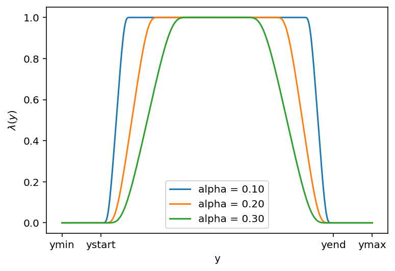
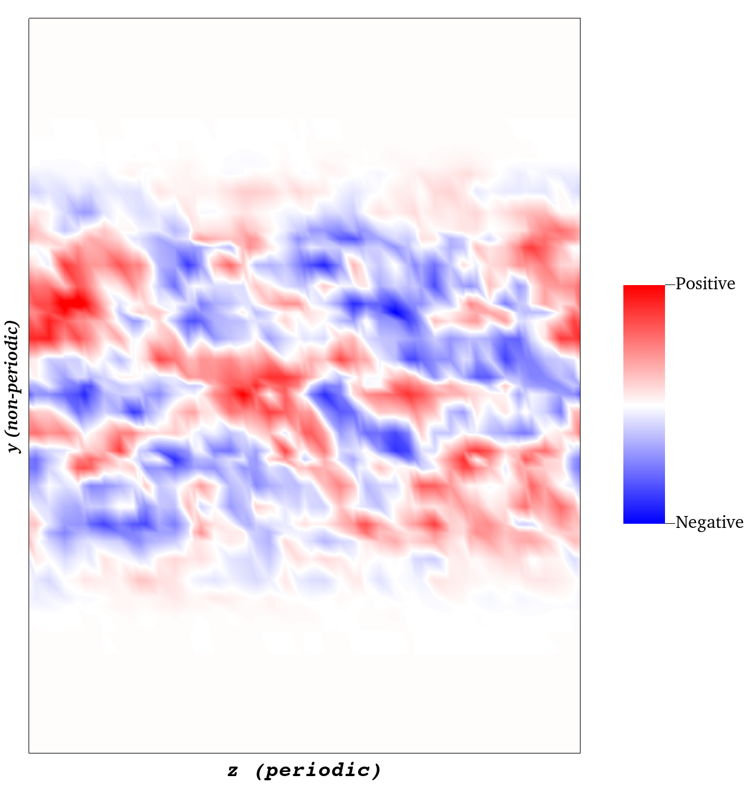

# Free-Stream turbulence generation

This is a neko implementation of the FST code applied as a boundary condition. The FST is applied with a fringe function in space and in time. 

# Usage

## FST parameters

Set your turbulent length scale, turbulence intensity, free-stream velocity and total wavenumber discretization parameters in `01_global_params.f90`. 

## User file

The initialization, generation, application of the FST is driven by `07_fst_bc_driver.f90`. This file implements three functions that must be used in the user file:
- `fst_bc_driver_initialize()`
- `fst_bc_driver_apply()`
- `fst_bc_driver_finalize()`

An example of usage is given in the user file `example/user.f90`. Note that to apply the boundary condition we use the `field_dirichlet_update` function which
requires the use of the `user_velocity` boundary condition on the desired boundary (see `example/run.case`).

## Case file

The driver module uses some parameters that should be given in the case file. Below is the JSON object taken from `example/run.case` that shows which parameters to use:

With file regeneration:
```.json
"FST": {
      "enabled": true,   // default is true
      "t_start": 0.0001, // Time at which to start applying FST
      "t_ramp": 0.001,   // Length of the linear ramp in time
      "alpha": 0.2,      // see below for full explanation of what this is
      "ystart": -0.01,   // Lower bound for the fringe function (Also exists for z, if y is periodic)
      "yend": 0.01,      // High bound for the fringe function  (Also exists for z, if y is periodic)
      "periodic_z": true, // Self-explanatory. If periodic in y add "periodic_y": true
      "regen_files": true, // Set to true to generate wavenumbers etc. See below for further explanation
      "Uinf": 1.0,       // Free-stream velocity. Only read if "regen_files" is false.      "fst_path": "src" // Path where the fst files should be written.
}
```

Without file regeneration (reuse previously written files)
```.json
"FST": {
      "enabled": true,   // default is true
      "t_start": 0.0001, // Time at which to start applying FST
      "t_ramp": 0.001,   // Length of the linear ramp in time
      "alpha": 0.2,      // see below for full explanation of what this is
      "ystart": -0.01,   // Lower bound for the fringe function (Also exists for z, if y is periodic)
      "yend": 0.01,      // High bound for the fringe function  (Also exists for z, if y is periodic)
      "periodic_z": true, // Self-explanatory. If periodic in y add "periodic_y": true
      "regen_files": false, // Set to true to generate wavenumbers etc. See below for further explanation
      "Uinf": 1.0,       // Free-stream velocity. Only read if "regen_files" is false.
      "fst_path": "src" // Path to the fst files from which to read.
}
```

@note That `fst_path` is interpreted differently based on the value of 
`regen_files`.

### FST generation

In the original implementation, FST wavenumbers and amplitudes are generated
on-the-fly at the beginning of the simulation. This is the default behavior in
the present implementation. Generating wavenumbers/amplitudes on-the-fly will
create three separate files:
- `bb.txt`, which contains the random phases,
- `fst_spectrum.csv`, which contains wavenumbers, amplitudes and the random,
  unitary, divergence-free vectors, and
- `sphere.dat`, which contains information about # shells, points per shell,
  and wavenumber discretization parameters.

You also have the possibility to reuse previously generated files to keep
the same FST parameters across two simulations. To do that, use the parameter
`FST.regen_files` and set it to `false`. Be careful that the 3 files mentioned
above must be present in the same folder as your executable. 

The format of the fst_spectrum.csv file is a bit special and differs
from previous implementations. This version of the code requires it to have 8
columns, which are as follows:

```.csv
ShellNo,kx,ky,kz,amp,u_hat_pn1,u_hat_pn2,u_hat_pn3
```

If `regen_files` is `false`, you must also specify the free-stream velocity
since nothing from `01_global_params.f90` will be used. This can be done via
the parameters `FST.Uinf`.

### Spatial fringe parameters

A smoothing function in space is applied on the 2D inlet boundary.
The shape of this fringe is the one used in SIMSON and by lots of other people:

$$
\lambda (y,z) = \lambda_y(y)\lambda_z(z),
$$

With

$$
\lambda_u = S\left( \frac{u - u_{start}}{\delta_{u,rise}}\right) - S\left( \frac{u - u_{end}}{\delta_{u,fall}}+1\right)
$$

Note that $\lambda_u = 1$ if the direction `u` is set to be periodic.


Below is an example of fringe function in 1 dimension.


And here is an example of how it looks like on an inlet boundary. In this case, we are showing
the z-component of velocity where the baseflow has 0 velocity. The z-direction is set to be 
periodic and therefore there is no smoothing along the z-direction. The y-direction is not 
periodic. We have exaggerated the extents of the fringe function to make it obvious, but
this will very much be case dependent.


The `_start` and `_end` parameters can be set by the user. By default, and only if the direction is not 
periodic, `_start`/`_end` will be set to the minimum/maximum coordinate on the boundary (in that direction). 

The quantities $\delta_{u,*}$ are computed as a percentage $\alpha$ of the total boundary length 
in the direction `u`: $\delta_{u,rise} = \delta_{u,fall} = \alpha * L_u$, where 
$L_u$ is the total domain length at the inlet in the direction u. 

The parameters that need to be set are:
- `y_start` and `y_end` if the `y` direction is not periodic
- `z_start` and `z_end` if the `z` direction is not periodic
- `alpha`, which takes a number between 0 and 1 (there is no check if > 1 or < 0).

Note that if any direction is set to periodic, the corresponding parameters _start and _end will not be used.

### Time parameters

It is possible to set a linear ramp in time to gradually apply the FST. Use the following parameters:
- `t_start`, the time at which to start applying the FST 
- `t_ramp`, the length of the linear ramp, where the amplitude of the FST grows linear up to 1 at `t = t_start + t_ramp`
